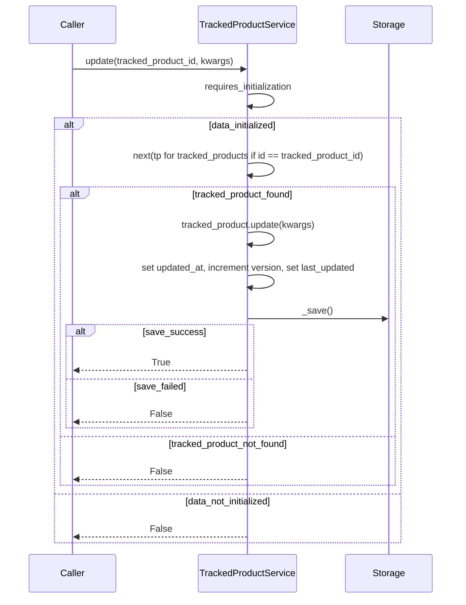

<!-- Generated by sourcery-ai[bot]: start review_guide -->

## Reviewer's Guide

Adds CRUD-style methods to the tracked product service (remove, update, get, get_all) and ensures tag retrieval uses the initialization guard, improving data handling consistency and persistence logging.

#### Sequence diagram for tracked product update flow

### File-Level Changes

| Change | Details | Files |
| ------ | ------- | ----- |
| Introduce remove, update, get, and get_all operations on tracked products with persistence and logging. | <ul><li>Import uuid to support UUID-based identifiers in service methods.</li><li>Add remove method that locates a tracked product by id, removes it from the in-memory collection, persists via _save, and logs success or failure.</li><li>Add update method that finds a tracked product by id, applies keyword-argument updates, updates timestamps and version metadata, persists via _save, and logs outcomes including not-found and error cases.</li><li>Add get method that retrieves a tracked product by id from the in-memory collection and validates it into TrackedProductPublic, returning None when not found.</li><li>Add get_all method that safely returns the tracked_products collection or an empty list when data is missing.</li></ul> | `app/services/trackedProduct.py` |
| Ensure tag listing respects initialization guard for consistent behavior with other tag operations. | <ul><li>Apply requires_initialization decorator to get_all_tags to return an empty list when service is not initialized.</li><li>Keep get_all_tags implementation returning tags collection or empty list based on data presence.</li></ul> | `app/services/tags.py` |

---

Tips and commands

#### Interacting with Sourcery

- **Trigger a new review:** Comment `@sourcery-ai review` on the pull request.
- **Continue discussions:** Reply directly to Sourcery's review comments.
- **Generate a GitHub issue from a review comment:** Ask Sourcery to create an
  issue from a review comment by replying to it. You can also reply to a
  review comment with `@sourcery-ai issue` to create an issue from it.
- **Generate a pull request title:** Write `@sourcery-ai` anywhere in the pull
  request title to generate a title at any time. You can also comment
  `@sourcery-ai title` on the pull request to (re-)generate the title at any time.
- **Generate a pull request summary:** Write `@sourcery-ai summary` anywhere in
  the pull request body to generate a PR summary at any time exactly where you
  want it. You can also comment `@sourcery-ai summary` on the pull request to
  (re-)generate the summary at any time.
- **Generate reviewer's guide:** Comment `@sourcery-ai guide` on the pull
  request to (re-)generate the reviewer's guide at any time.
- **Resolve all Sourcery comments:** Comment `@sourcery-ai resolve` on the
  pull request to resolve all Sourcery comments. Useful if you've already
  addressed all the comments and don't want to see them anymore.
- **Dismiss all Sourcery reviews:** Comment `@sourcery-ai dismiss` on the pull
  request to dismiss all existing Sourcery reviews. Especially useful if you
  want to start fresh with a new review - don't forget to comment
  `@sourcery-ai review` to trigger a new review!

#### Customizing Your Experience

Access your [dashboard](https://app.sourcery.ai) to:
- Enable or disable review features such as the Sourcery-generated pull request
  summary, the reviewer's guide, and others.
- Change the review language.
- Add, remove or edit custom review instructions.
- Adjust other review settings.

#### Getting Help

- [Contact our support team](mailto:support@sourcery.ai) for questions or feedback.
- Visit our [documentation](https://docs.sourcery.ai) for detailed guides and information.
- Keep in touch with the Sourcery team by following us on [X/Twitter](https://x.com/SourceryAI), [LinkedIn](https://www.linkedin.com/company/sourcery-ai/) or [GitHub](https://github.com/sourcery-ai).

<!-- Generated by sourcery-ai[bot]: end review_guide -->