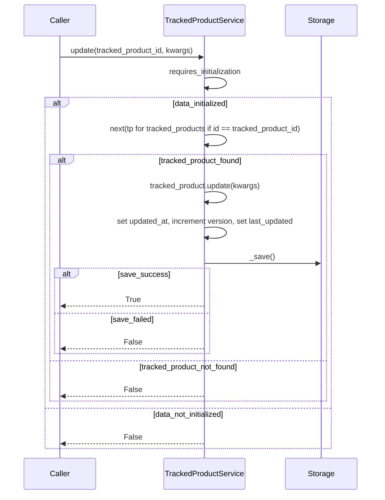

<!-- Generated by sourcery-ai[bot]: start review_guide -->

## Reviewer's Guide

Adds CRUD-style methods to the tracked product service (remove, update, get, get_all) and ensures tag retrieval uses the initialization guard, improving data handling consistency and persistence logging.

#### Sequence diagram for tracked product update flow

### File-Level Changes

| Change | Details | Files |
| ------ | ------- | ----- |
| Introduce remove, update, get, and get_all operations on tracked products with persistence and logging. | <ul><li>Import uuid to support UUID-based identifiers in service methods.</li><li>Add remove method that locates a tracked product by id, removes it from the in-memory collection, persists via _save, and logs success or failure.</li><li>Add update method that finds a tracked product by id, applies keyword-argument updates, updates timestamps and version metadata, persists via _save, and logs outcomes including not-found and error cases.</li><li>Add get method that retrieves a tracked product by id from the in-memory collection and validates it into TrackedProductPublic, returning None when not found.</li><li>Add get_all method that safely returns the tracked_products collection or an empty list when data is missing.</li></ul> | `app/services/trackedProduct.py` |
| Ensure tag listing respects initialization guard for consistent behavior with other tag operations. | <ul><li>Apply requires_initialization decorator to get_all_tags to return an empty list when service is not initialized.</li><li>Keep get_all_tags implementation returning tags collection or empty list based on data presence.</li></ul> | `app/services/tags.py` |

---
