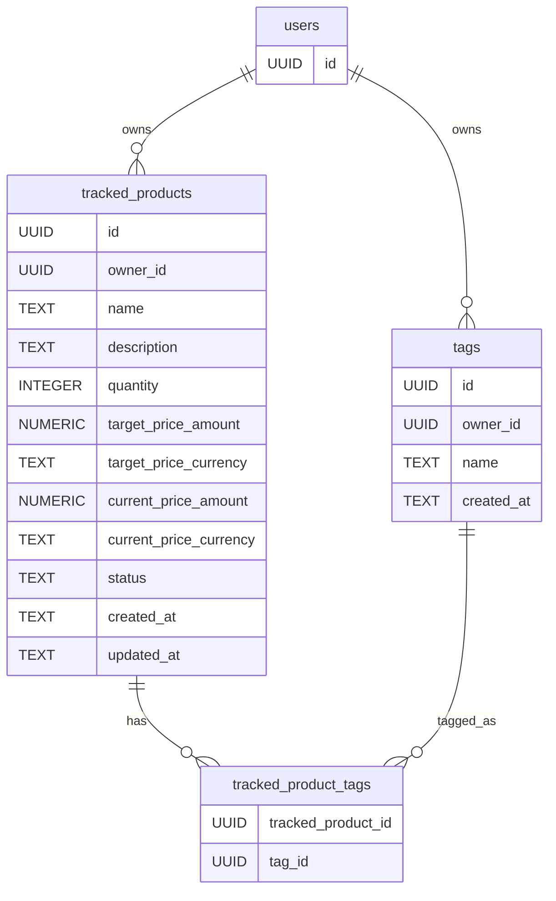

# Project Overview: SQLite Migration for the Tracked Products Backend

Tags: #fastapi #sqlite3 #pydantic #architecture #project-notes

---

## Overview

This is a working reference for the current state of the `backend-course` project — a FastAPI application that lets a user track products across e-commerce sites, tag them, and get notified when a target price is reached. The project recently moved its persistence layer from flat JSON files to SQLite, and this note documents the architecture as it stands after that migration, including the real bugs found and fixed along the way. A pull request covering this migration was reviewed by Sourcery; its summary is folded into this note where relevant.

**Repository:** [github.com/shinji585/backend-course](https://github.com/shinji585/backend-course)

---

## What Changed: JSON Files to SQLite

The project's original persistence layer stored `tags` and `tracked_products` as two flat JSON files, each holding a list of records plus a top-level `version` counter and `last_updated` timestamp. This worked, but it had two structural limits that motivated the move to SQLite:

1. **No relational integrity.** A tracked product's `tags_id` field was just a list of UUID strings inside the JSON, with nothing enforcing that those UUIDs actually corresponded to real tags — a typo or a deleted tag would leave a silently broken reference.
2. **No safe concurrent writes.** Every read-modify-write cycle against the JSON file risked one caller's changes overwriting another's if two updates happened close together, since the whole file was rewritten on every save.

SQLite solves both: foreign keys enforce that a `tag_id` must correspond to a real row in `tags`, and each write is a single, atomic SQL statement rather than a full-file rewrite.

---

## Entity Relationship Diagram



Two design decisions worth restating here, since they shape everything downstream:

- **`target_price` and `current_price` are flattened into `*_amount`/`*_currency` column pairs.** Neither SQLite nor most relational databases have a native "money + currency" type, so the `Price` value object used throughout the Pydantic schemas is split into two scalar columns at the table level, and reassembled back into a `Price` object at the schema boundary.
- **`tracked_product_tags` is an association table**, not a column. A tracked product's `tags_id` field is a `list[uuid.UUID]` on the Pydantic side, which cannot live in a single SQL column — it becomes one row per tag, linking a product to each tag it has.

---

## Layered Architecture

```
app/
├── db/
│   └── repositories/
│       ├── tag_repository.py
│       └── tracked_product_repository.py
├── schemas/
│   ├── tags/
│   │   ├── base.py, create.py, update.py, public.py, internal.py
│   └── tracked/
│       ├── base.py, create.py, update.py, public.py, internal.py
├── services/
│   ├── tags.py
│   └── trackedProduct.py
├── routers/
│   └── trackedProductRouter.py
└── deps.py
```

Each layer has exactly one job, and no layer skips ahead to do another layer's work:

| Layer | Knows about SQL? | Knows about HTTP? | Responsibility |
|---|---|---|---|
| Router | No | Yes | Route requests, raise `HTTPException` on failure, apply `response_model` |
| Service | No | No | Business logic — resolving tags, flattening prices, orchestrating repositories |
| Repository | Yes | No | Execute SQL, convert between plain dicts and database rows |
| Schema | No | No | Validate the shape of data entering and leaving the system |

---

## `TagRepository`

`app/db/repositories/tag_repository.py` owns all SQL for the `tags` table.

```sql
CREATE TABLE IF NOT EXISTS tags (
    id         UUID PRIMARY KEY,
    owner_id   UUID,
    name       TEXT NOT NULL,
    created_at TEXT NOT NULL,
    FOREIGN KEY (owner_id) REFERENCES users (id)
);
```

Methods: `save`, `save_many`, `find_by_id`, `find_by_name`, `find_all`, `update`, `delete`. Every connection is opened with `detect_types=sqlite3.PARSE_DECLTYPES`, paired with a registered adapter/converter for `uuid.UUID`, so repository methods pass and receive real `uuid.UUID` objects rather than manually converting to and from strings. `row_factory` is set to `sqlite3.Row` on read methods so `dict(row)` produces a plain dict suitable for `PublicTag.model_validate(...)`.

Two real bugs were found and fixed in this file during review:

- **Placeholder mismatch.** `find_by_id` and `delete` originally executed SQL using a named placeholder (`:id`, `:tag_id`) but passed a positional tuple (`(tag_id,)`) as the parameter — a mismatch that raises `sqlite3.ProgrammingError` on every call. Fixed by passing a matching dict (`{"id": tag_id}`).
- **`delete` always returned `True`.** It never checked whether the `DELETE` statement actually matched a row, so deleting a nonexistent `tag_id` silently reported success. Fixed with `return cursor.rowcount > 0`, mirroring the check already present in `update`.

`find_by_id` also needed a guard against `fetchone()` returning `None` — `PublicTag.model_validate(dict(row)) if row else None` — since `dict(None)` raises `TypeError` before validation ever runs. `find_all`, by contrast, needs no such guard: `fetchall()` always returns a list, empty or not, so a list comprehension over it degrades gracefully to `[]` with no special-casing required.

---

## `TrackedProductRepository`

`app/db/repositories/tracked_product_repository.py` owns SQL for `tracked_products` and `tracked_product_tags` together.

```sql
CREATE TABLE IF NOT EXISTS tracked_products (
    id                      UUID PRIMARY KEY,
    owner_id                UUID,
    name                    TEXT NOT NULL,
    description             TEXT,
    quantity                INTEGER NOT NULL DEFAULT 1,
    target_price_amount     NUMERIC(12, 2) NOT NULL,
    target_price_currency   TEXT NOT NULL,
    current_price_amount    NUMERIC(12, 2),
    current_price_currency  TEXT,
    status                  TEXT NOT NULL DEFAULT 'tracking'
                                CHECK (status IN ('tracking', 'paused', 'purchased', 'cancelled')),
    created_at              TEXT NOT NULL,
    updated_at              TEXT,
    FOREIGN KEY (owner_id) REFERENCES users (id)
);

CREATE TABLE IF NOT EXISTS tracked_product_tags (
    tracked_product_id UUID NOT NULL,
    tag_id             UUID NOT NULL,
    PRIMARY KEY (tracked_product_id, tag_id),
    FOREIGN KEY (tracked_product_id) REFERENCES tracked_products (id),
    FOREIGN KEY (tag_id) REFERENCES tags (id)
);
```

`save` inserts the product row and then loops over the incoming `tags_id` list, inserting one row per tag into `tracked_product_tags`, all within the same connection.

`find_by_id` and `find_all` both use a `LEFT JOIN` against `tracked_product_tags` — deliberately `LEFT` rather than an inner `JOIN`, so a product with zero tags is still returned, with `tag_id` coming back as `NULL` rather than the row disappearing entirely. Because a join like this returns one row per tag rather than one row per product, both methods use `fetchall()` and then regroup the flat rows in Python into `{..., "tags_id": [uuid1, uuid2, ...]}`.

**A key architectural decision:** these two methods return **plain dicts**, not `TrackedProductPublic` objects. This was corrected mid-review — the repository originally called `TrackedProductPublic.model_validate(...)` internally, which caused two problems: `TrackedProductPublic` has no `tags_id` field to validate against (only `TrackedProductInternal` does), and it meant the repository — which should know nothing about tag resolution — was responsible for a job that belongs to the service. Pylance's static type checker caught this directly, flagging `Argument of type "TrackedProductPublic" cannot be assigned to parameter "data" of type "dict[Unknown, Unknown]"` at the call site in the service, which is what surfaced the mismatch before it caused a runtime crash.

`update` builds its `SET` clause dynamically from whatever keys are present in the `data` dict, so one method handles a partial update touching one field or several. `delete` checks `cursor.rowcount > 0`, same pattern as `TagRepository`.

---

## `TagsServices`

`app/services/tags.py` sits between the router/other services and `TagRepository`.

```python
class TagsServices:
    def __init__(self, db_path: Path) -> None:
        self._repo = TagRepository(db_path)
```

`add_tag(name: str | list[str] | None = None)` handles three cases in one method:

- **`None`** — the "create a default tag" case. Before creating one, it checks `find_by_name` against the default name, specifically to prevent creating a new UUID-bearing duplicate every time `add_tag()` is called with no argument.
- **A single `str`** — checks `find_by_name` first; if it already exists, returns the existing `PublicTag` rather than creating a duplicate.
- **A `list[str]`** — checks each name individually, splits into "already exists" and "genuinely new," and batches only the new ones through `save_many` in a single call.

This method depends on `find_by_name`, which had to be added to `TagRepository` during the rebuild — it didn't exist in the SQL version originally, having been carried over conceptually from the old JSON-based service without actually being reimplemented.

`remove_tag`, `update_tag`, `get_tag`, and `get_all_tags` are thin wrappers around the matching repository methods, with logging added around success/failure.

---

## `TrackedProductServices`

`app/services/trackedProduct.py` is the most involved service in the project, since it has to bridge two mismatches the repository alone can't resolve: nested `Price` objects versus flat SQL columns, and `tags_id` (a list of UUIDs) versus `tags` (a list of resolved `PublicTag` objects).

```python
class TrackedProductServices:
    def __init__(self, db_path: Path, tags_db_path: Path) -> None:
        self._repo = TrackedProductRepository(db_path)
        self._tag_services = TagsServices(tags_db_path)
```

**`_flatten`** converts a `TrackedProductInternal` object's nested `target_price`/`current_price` into the four scalar columns the database actually has — used unconditionally in `create`, since a full internal object always has both price fields present (`current_price` may be `None`, but the field itself always exists).

**`_to_public`** is the inverse direction: given a raw dict from the repository (still containing `tags_id`), it resolves each tag ID into a real `PublicTag` via `self._tag_services.get_tag(tag_id)`, drops `tags_id` and `owner_id`, and builds the final `TrackedProductPublic`. This one method replaced what used to be duplicated logic across `create`, `get`, and `get_all`.

**`create`** resolves tag names into `PublicTag` objects via `self._tag_services.add_tag(name=names)`, builds a `TrackedProductInternal`, flattens it, saves it, and returns the result of re-reading it back through `_to_public` — reading it back rather than trusting the in-memory object guarantees the response reflects exactly what's in the database.

**`update`** required its own, separate flattening step from `create`'s, because a `PATCH` payload is partial by nature — `target_price` may or may not be one of the keys present in a given call, so the flattening logic there is conditional (`if "target_price" in data: ...`) rather than unconditional. This was the last real bug found in the service layer: an update sent with a `target_price` field would previously pass that key straight through to the repository's dynamic `SET` clause, producing `sqlite3.OperationalError: no such column: target_price` — caught by the generic exception handler and surfaced to the client as a misleading 404, since the product genuinely exists; the write just targeted a column that was never real.

**`get`** and **`get_all`** both call the repository's raw-dict-returning methods and pipe the result through `_to_public`.

---

## Router and Dependency Wiring

`app/routers/trackedProductRouter.py` exposes the standard five endpoints (`POST`, `GET` by ID, `GET` list, `PATCH`, `DELETE`), each depending on `TrackedProductServices` via `Depends(get_tracked_product_services)`.

Two mismatches were caught and fixed here during the migration:

- **`create`** originally checked for a `Literal[False]` return value alongside `None`, a leftover from an earlier version of the service that used `Literal[False]` as a distinct "internal error" sentinel. The rebuilt service only ever returns `None` on any failure, so that branch became dead code and was removed.
- **`update`** originally spread `payload.model_dump(...)` into the service call as `**kwargs`, but `TrackedProductServices.update` takes a single `data: dict` argument, not keyword-spread fields. Fixed to `service.update(tracked_product_id=..., data=payload.model_dump(exclude_unset=True, mode="json"))`.

`app/deps.py` wires up the dependency injection:

```python
@lru_cache
def get_tracked_product_services() -> TrackedProductServices:
    return TrackedProductServices(
        db_path=DATA_DIR / "TrackedProduct.db",
        tags_db_path=DATA_DIR / "tagsData.db",
    )
```

`@lru_cache` with no arguments makes this function a singleton — the first call constructs `TrackedProductServices` once, and every subsequent call across every request returns the same cached instance. This is safe specifically because neither repository holds a connection open between calls; every method opens and closes its own `sqlite3.connect(...)` inside a `with` block, so sharing one service instance across concurrent requests never means sharing one open SQLite connection across threads.

---

## Known Inconsistencies, Deliberately Left As-Is

Two naming inconsistencies were identified during review and intentionally not changed, to avoid unnecessary churn this late in the migration:

- **Database filenames** (`TrackedProduct.db`, `tagsData.db`) mix PascalCase and camelCase, inconsistent with the `snake_case` convention used everywhere else in the project (table names, column names, most module names). A future cleanup could rename these to `tracked_products.db` / `tags.db`.
- **Module name** `app/services/trackedProduct.py` is camelCase, inconsistent with `tag_repository.py` and `tracked_product_repository.py`. Left unchanged since renaming would require updating every import across the router, `deps.py`, and `app/services/__init__.py`.

---

## Summary Table

| Component | File | Responsibility |
|---|---|---|
| `TagRepository` | `db/repositories/tag_repository.py` | SQL for `tags` |
| `TrackedProductRepository` | `db/repositories/tracked_product_repository.py` | SQL for `tracked_products` + `tracked_product_tags` |
| `TagsServices` | `services/tags.py` | Name-based dedup, tag CRUD orchestration |
| `TrackedProductServices` | `services/trackedProduct.py` | Price flattening, tag resolution, response assembly |
| `trackedProductRouter` | `routers/trackedProductRouter.py` | HTTP routes, error translation |
| `deps.py` | `deps.py` | Singleton service construction via `lru_cache` |

---

## Further Reading

- [Python — `sqlite3`: DB-API 2.0 Interface for SQLite Databases](https://docs.python.org/3/library/sqlite3.html)
  Covers `detect_types`, adapters/converters, `Row`, and parameterized queries used throughout both repositories.

- [SQLite — Foreign Key Support](https://www.sqlite.org/foreignkeys.html)
  Covers the constraints enforced by `tracked_product_tags` and `owner_id` references to `users`.

- [FastAPI — Dependencies](https://fastapi.tiangolo.com/tutorial/dependencies/)
  Covers the `Depends()` pattern used in `get_tracked_product_services` and throughout the router.

---

*Last reviewed: July 2026*